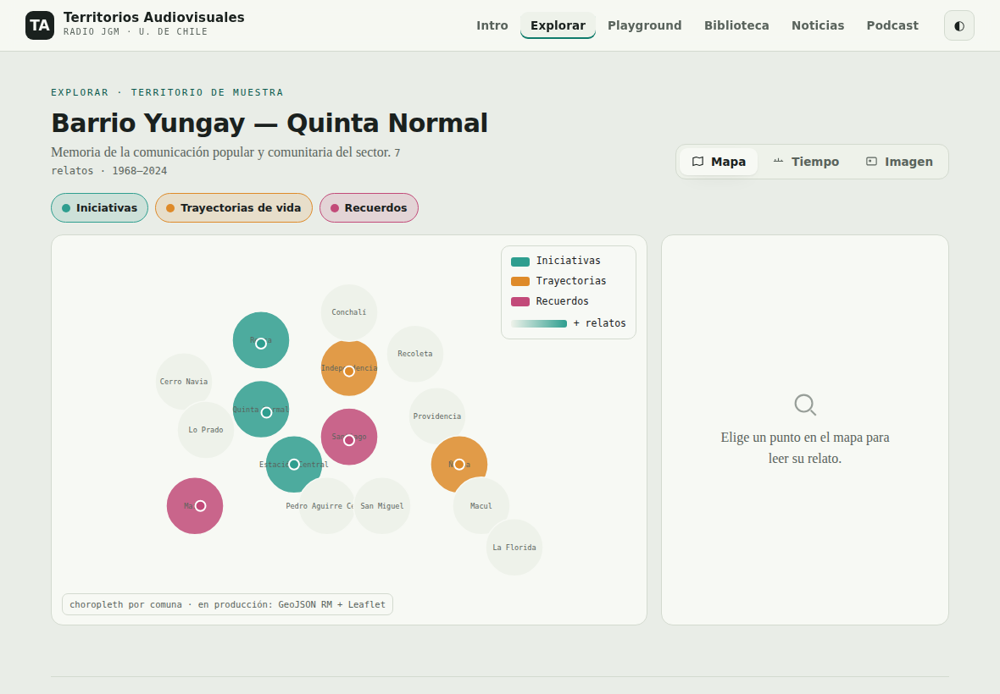
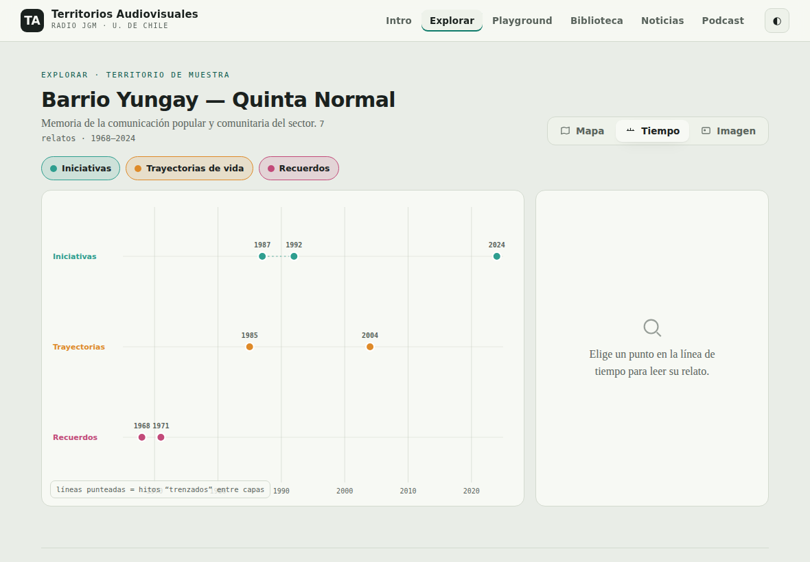
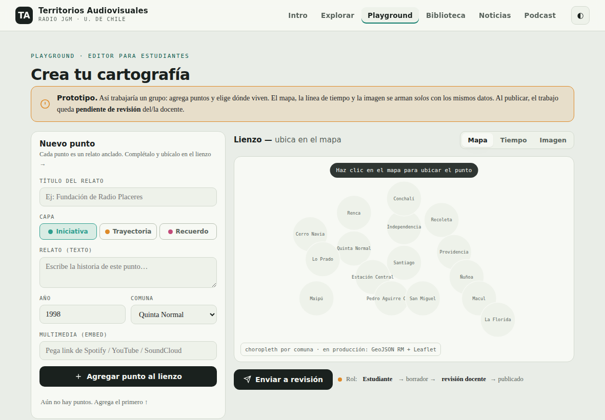

# Territorios Audiovisuales — Prototipo

Prototipo navegable de una plataforma para **cartografiar territorios en tres formatos** a partir de un mismo corpus de relatos, desarrollado como base de la propuesta para **Radio JGM** (Escuela de Periodismo — Facultad de Comunicación e Imagen, Universidad de Chile).

> **Estado:** prototipo / *mock*. El contenido es de ejemplo y no representa datos reales. Sirve para mostrar la experiencia y validar el concepto antes del desarrollo.

## La idea: un corpus, tres lentes

Cada relato es un **punto anclado** con texto y multimedia embebida. Lo que cambia entre formatos es a qué se ancla:

| Formato | Ancla |
|---|---|
| 🗺️ Mapa | comuna + coordenada (choropleth por capa + puntos) |
| 🕐 Línea de tiempo | fecha (carriles por capa, con “trenzado” entre capas) |
| 🖼️ Imagen interactiva | posición sobre una ilustración (puntos calientes) |

Se carga el relato **una vez** y se proyecta en los tres formatos. Las capas son *Iniciativas · Trayectorias de vida · Recuerdos*.

## Playground para estudiantes

El prototipo incluye un **editor** pensado para que grupos de estudiantes creen sus propias cartografías sin programar: agregan puntos, los ubican con un clic (mapa, fecha o imagen) y los tres visores se generan solos. Flujo editorial: *estudiante → borrador → revisión docente → publicado*.

## Capturas

## Cómo verlo

Abre `index.html` en cualquier navegador (doble clic). No requiere servidor ni instalación.
El mapa carga [d3-delaunay](https://github.com/d3/d3-delaunay) desde CDN para generar las celdas de comunas; sin conexión, cae a una versión simplificada y sigue funcionando.

## Stack objetivo (producción)

- **WordPress** existente de Radio JGM (LiteSpeed + PHP/MySQL), con un **plugin propio**: tipo de contenido “relato”, taxonomía de capas, roles y flujo de moderación nativos y API REST.
- **Visores** en JS liviano que leen del REST. Mapa con **Leaflet + GeoJSON de comunas de la RM**.
- Multimedia **embebida** (Spotify / YouTube), para mantener el hosting liviano.

## Roadmap

- **Fase 1 — plataforma base:** los 3 visores + secciones (Intro, Biblioteca, Noticias, Podcast) + editor.
- **Fase 2 — autoría abierta:** afinar el playground para 13–15 grupos de estudiantes.
- **Fase 3:** cartografías creadas por las propias comunidades.

## Autor

**David Vásquez Ovalle** — desarrollo web y comunicación.

## Licencia

MIT — ver [LICENSE](LICENSE).
